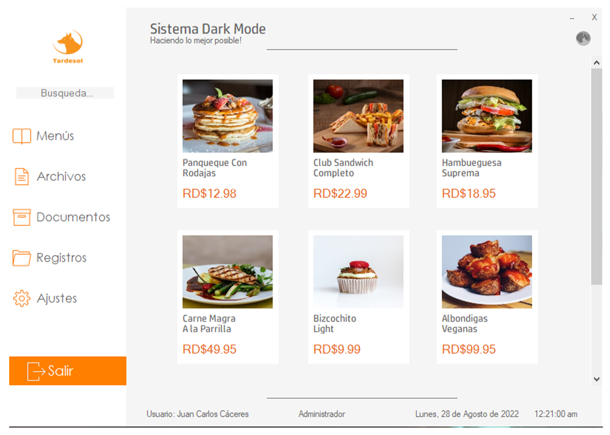
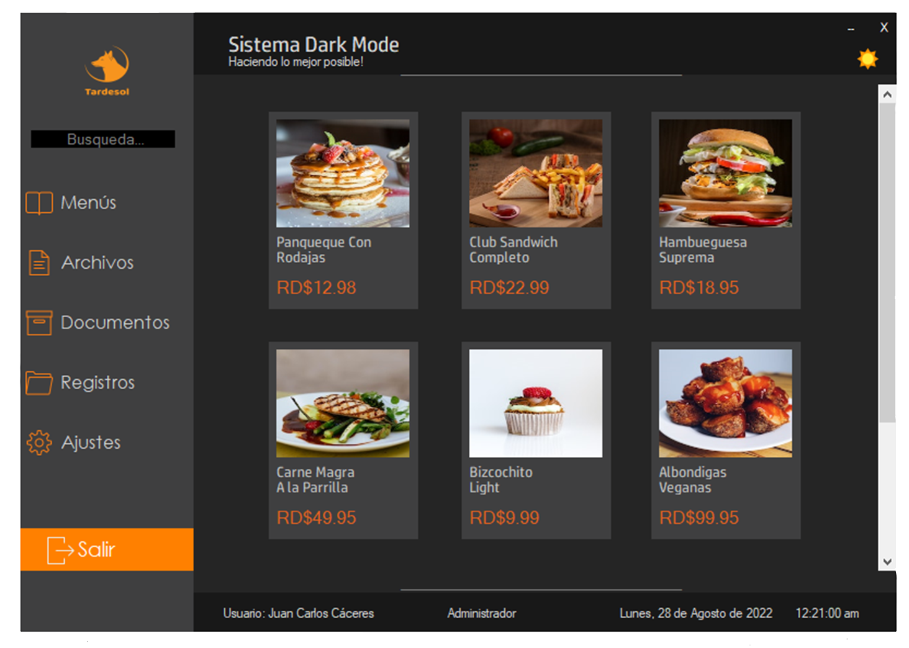

# GUI en Windows Forms de un POS 
##Interfaz de aplicación POS RETAIL para Windows con modo oscuro.
 
 

 
<b> Solo es un formulario el cual cambia las propiedades de color de cada control al presionar un botón.</b>
 
 
<b>De modo claro...</b>

 

<b> ...al modo oscuro.</b>
 

 
El archivo que contiene el codigo es Form1.cs, los demás son creados de forma automatica por VS.
 
 
Puedes descargar el archivo instalador desde mega:  https://mega.nz/file/EogwXBxS#9D7riGdl9W0ppQKRSkMDdWcWYXmwEJXwmU79bbr_ELA
 
 
Sin más nada por el momento me despido, no pares de aprender y si quieres deja para un café XD : https://paypal.me/juancarloscr8
